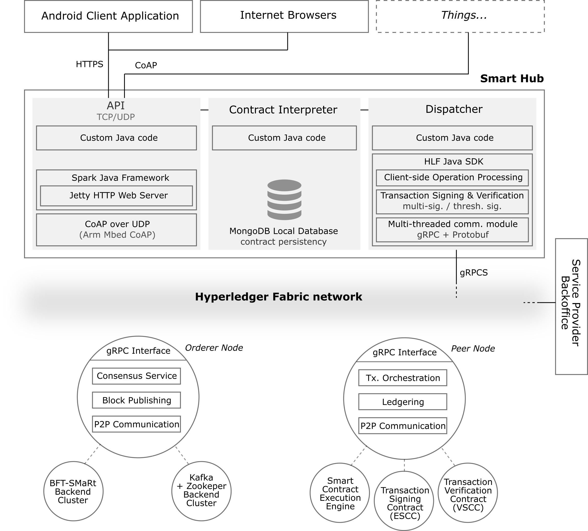

# Prototype for a Decentralized and Scalable Ledgering system for the Internet-of-Things (IoT)

This repository hosts the codebase for the prototype that was built for an MSc. Thesis, whose purpose is to provide a decentralized and scalable middleware for IoT environments using blockchain technology.

## Context

The Internet-of-Things (IoT) is simultaneously the largest and the fastest growing distributed system known to date. With the expectation of 50 billion of devices coming online by 2020, far surpassing the size of the human population, problems related to scale, trustability and security are anticipated. Current IoT architectures are inherently flawed as they are centralized on the cloud and explore fragile trust-based relationships over a plethora of loosely integrated devices, leading to IoT platforms being non-robust for every party involved and unable to scale properly in the near future. The need for a new architecture that addresses these concerns is urgent as the IoT is progressively more ubiquitous, pervasive and demanding regarding the integration of devices and processing of data increasingly susceptible to reliability and security issues.

Thus, we propose a decentralized ledgering solution for the IoT, leveraging a recent concept: blockchains. Rather than replacing the cloud, our solution presents a scalable and fault-tolerant middleware for recording transactions between peers, under verifiable and decentralized trustability assumptions and authentication guarantees for IoT devices, cloud services and users. Following on the emergent trend in modern IoT architectures, we leverage smart hubs as blockchain gateways, aggregating, pre-processing and forwarding small amounts of data and transactions in proximity conditions, that will be verified and processed as transactions in the blockchain. The proposed middleware acts as a secure ledger and establishes private channels between peers, requiring transactions in the blockchain to be signed using threshold signature schemes and group oriented verification properties. The approach improves the decentralization and robustness
characteristics under Byzantine fault-tolerance settings, while preserving the blockchain distributed nature.

## Architecture

  

