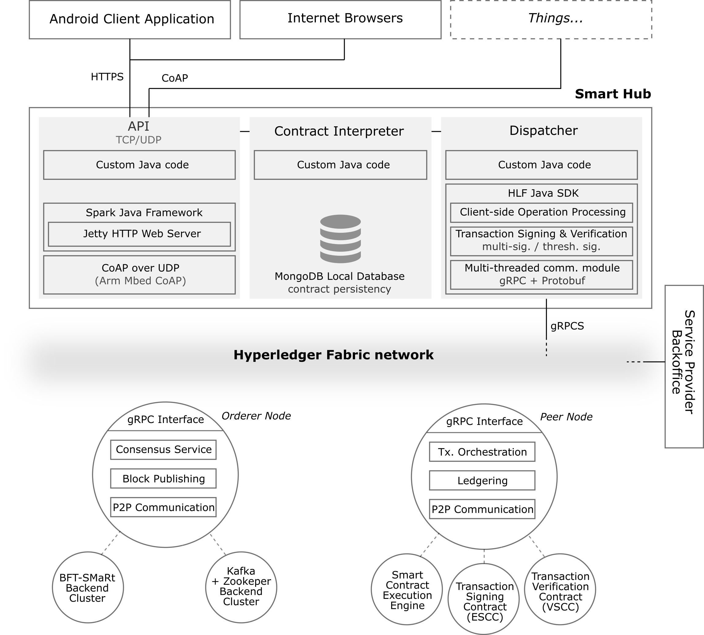

# Prototype for a Decentralized and Scalable Ledgering system for the Internet-of-Things (IoT)

This repository hosts the prototype demonstration for a system built for an MSc. Thesis, whose purpose is to provide a decentralized and scalable middleware for IoT environments using blockchain technology.

## Context

The Internet-of-Things (IoT) is simultaneously the largest and the fastest growing distributed system known to date. With the expectation of 50 billion of devices coming online by 2020, far surpassing the size of the human population, problems related to scale, trustability and security are anticipated. Current IoT architectures are inherently flawed as they are centralized on the cloud and explore fragile trust-based relationships over a plethora of loosely integrated devices, leading to IoT platforms being non-robust for every party involved and unable to scale properly in the near future. The need for a new architecture that addresses these concerns is urgent as the IoT is progressively more ubiquitous, pervasive and demanding regarding the integration of devices and processing of data increasingly susceptible to reliability and security issues.

Thus, we propose a decentralized ledgering solution for the IoT, leveraging a recent concept: blockchains. Rather than replacing the cloud, our solution presents a scalable and fault-tolerant middleware for recording transactions between peers, under verifiable and decentralized trustability assumptions and authentication guarantees for IoT devices, cloud services and users. Following on the emergent trend in modern IoT architectures, we leverage smart hubs as blockchain gateways, aggregating, pre-processing and forwarding small amounts of data and transactions in proximity conditions, that will be verified and processed as transactions in the blockchain. The proposed middleware acts as a secure ledger and establishes private channels between peers, requiring transactions in the blockchain to be signed using threshold signature schemes and group oriented verification properties. The approach improves the decentralization and robustness characteristics under Byzantine fault-tolerance settings, while preserving the blockchain distributed nature.

## Architecture

The following Figure illustrates the architecture of the prototype:

<p align="center">
  
</p>

The prototype is modeled in a tiered architecture composed by three different layers. These represent different software services and components:
* On the lower level, are the blockchain-enabled services, leveraged by an _extended_ version of the Hyperledger Fabric platform, where the support for interchangeable threshold and group multi-signatures was added, integrated with extended consensus plane services for the support of Byzantine fault-tolerant properties;
* On the center, is the materialization of the concept of smart hubs, responsible for the intermediation of interactions from user devices and IoT devices (regarded as clients of the provided services in the blockchain-enabled architecture), and forwarding those operations as transactions with data-management functions enabled by the backed blockchain services;
* On the upper and final level, we have the actual clients of the service that could be found in regular IoT environments (_things_ or IoT devices, and end users).

In terms of technologies and communication protocols, the bottom layer inherits from Hyperledger Fabric the gRPC protocol for communication between blockchain nodes and the Golang codebase. The smart hub layer was implemented in Java, using a slightly modified version of the Hyperledger Fabric SDK and harnessing CoAP and HTTP protocols for communication with client entities (using the CoAP library by https://github.com/ARMmbed/java-coap and the lightweight Java Spark framework which comes with an integrated Jetty HTTP server http://sparkjava.com/). Further, this layer uses MongoDB for caching data. For the final layer, we provide a test Java CoAP client implementation and an Android client.

## Pre-requisites

## Instructions

The prototype's software artifacts can be found in the `demo` folder.

#### 1. Starting a Blockchain Services network

This first set of steps will start a bootstrap Docker virtual network for the blockchain services layer of the prototype. This will start a blockchain network with a size of 20 peer nodes and 4 orderer nodes, that can have BFT consensus guarantees or not, and can use threshold signature or multi-signature schemes for transaction endorsement flows within the blockchain, depending on the user-defined configuration. As it requires the usage of multiple Docker containers simultaneously for emulating blockchain nodes and their inner services and components, it is recommended that this is executed on a high-end machine. It can also be done in a distributed setting upon configuration of the Docker Compose YAML files. However, the configurations we provide are generically set up for a virtual distributed environment within a single physical machine.

1. Go into the blockchain services network folder: `cd demo/blockchain-network`. Within this folder you will find a few YAML files, some subfolders and a set of bash scripts: `generate.sh`, `start.sh`, `stop.sh`, `kill.sh`. These scripts are responsible for generating the genesis block and any needed cryptographic material for node communication, membership and identification, for starting an instance of the blockchain network and all underlying services and nodes, for stopping the network temporarily, and for _killing_ the network as whole by clearing all its resources. 

2. Create two empty folders named `crypto-config` and `channel-artifacts`. These will hold cryptographic material for blockchain nodes and membership policies and the genesis block and any Hyperledger Fabric channel configurations. 

3. Run the `generate.sh` script in a terminal, which will ask you if you want to run a Kafka-based network (not BFT) or a BFT version. The folders in the previous step should now be populated.

4. Run the `start.sh` script, which will ask you again if you want to run a Kafka-based network or the BFT version (the same choice as in step 4 has to be taken, otherwise the startup process will fail). Note that this may take a while as the Docker network will have to be set up and all Hyperledger Fabric actions to initiate a communication channel between peers will be done automatically. As we use our extended version of Fabric, on a first run, this process will also download any needed custom-built Docker images. The output of the script is very verbose and will alert the user upon completion. Please note that errors may occur if the machine does not have enough resources to load all Docker containers.

5. To inspect the network you have just launched use `docker ps`. All 20 peer nodes and 4 orderer nodes should be up and running, together with their respective chaincode containers, CouchDB instances and consensus cluster nodes (either Kafka or BFT-SMaRt).


The network will default to a lenient threshold signature endorsement policy which allows all nodes to sign a given transaction. This can be changed by modifying the `CHAINCODE_ENDORSEMENT_POLICY` and `ENDORSEMENT_SIGNATURE_SCHEME` environment variables in the beggining of the `start.sh` script. The first flag is the standard endorsement Hyperledger Fabric policy configuration, while the second is what allows the blockchain to decide whether to use threshold signatures or multi-signatures to sign and verify transactions. These flags will be used to initiate the test chaincode named `xcc` provided in `chaincode\xcc`. It's important to note that these configurations are related with chaincode configuration and not with the network itself, which could be running different and multiple chaincodes.


#### 2. Booting up a Smart Hub

1. Go back to the `demo` folder and then into `smart-hub\conf`. Open the file `config.properties`, which holds all configurations for running the smart hub instance.

2. Change any needed configurations in the file. Start by going to the bottom of the file and identify the following sections:

```
hlf.bootstrapNodes = peer0
hlf.bootstrapNodes = peer1
hlf.bootstrapNodes = peer2
hlf.bootstrapNodes = peer3
hlf.bootstrapNodes = peer4
hlf.bootstrapNodes = peer5
hlf.bootstrapNodes = peer6
hlf.bootstrapNodes = orderer0
hlf.bootstrapNodes = orderer1
```

This section represents all known bootstrap nodes for the smart hub. We recommend leaving this as is and editing the following sections, which represent a boostrap node connection:

```
bootstrapNode.peer0.type = 0 
bootstrapNode.peer0.name = peer0.blockchain-a.com
bootstrapNode.peer0.host = 51.255.64.183
bootstrapNode.peer0.port = 7051
bootstrapNode.peer0.eventHubPort = 7053
```

The first parameter represents the type of the node (0 for a peer node and 1 for an orderer node), the second is the name given to the node, while the following parameters represent where the node is hosted and on which port is it listening. The event hub port is only applicable to peer nodes and not to orderers. Here, change the parameter `bootstrapNode.peerX.host`, where _X_ is the number of the node, to the host machine address of the blockchain network configured in the previous set of steps.

You can explore the other configuration parameters if you wish, but we recommend leaving it as is.

3. (_Optional_) Go to the top of file where you can find the properties below. These can be changed to configure different CoAP and HTTP communication ports and thread pool sizes, as well as HTTPS properties.

```
api.rest.port = 8080
api.rest.threadPool.max = 12
api.rest.threadPool.min = 2
api.rest.threadPool.timeout = 40000
api.coap.port = 5683
api.coap.threadPool = 12
api.ssl.keystorePath = crypto/tls/server.keystore
api.ssl.keystorePw = sparkmeup
api.ssl.truststorePath = crypto/tls/server.truststore
api.ssl.truststorePw = sparkmeup
api.ssl.muthualAuth = true
```

The `crypto.threshsig.groupKey` parameter which follows next on the file is the public key for when threshold signature schemes are used for endorsing blockchain transactions, and the following section configures a database connection to a local MongoDB instance.

```
mongo.address = mongodb://localhost:27017
mongo.database = beckie
mongo.contractCollection = contracts
```

Finally, the last section, seen below, is related with the integration between the smart hub and the blockchain services via the Hyperledger Fabric SDK. Again, we recommend leaving this as is.

```
hlf.channelName = mainchannel

hlf.chaincode.callInterval = 500
hlf.communication.negotiationMode = TLS
hlf.communication.sslProvider = openSSL
hlf.transaction.timeout = 400000
hlf.proposal.timeout = 400000

hlf.client.username = User1@blockchain-a.com
hlf.client.mspid = PeersAMSP
hlf.client.org = PeersA
hlf.client.crtPath = crypto/hlf/user/User1@blockchain-a.com-cert.pem
hlf.client.keyPath = crypto/hlf/user/User1@blockchain-a.com-priv.pem

hlf.trustedCasPath = crypto/hlf/peer-ca
```

4.

5. Run the command below to start a local MongoDB instance. You might need to run it with administrator privileges.
```
mongod
```

6. Open a separate terminal and run the command below. If running the smart hub on a privileged port (e.g. TCP 80), you might need to run the command with administrator privileges.
```
java -jar dsl-api-1.0.1-jar-with-dependencies.jar
```


## Open issues

* At the moment we have no utility for generating threshold signature keys. Thus, the prototype only allows using the RSA threshold signatures with a modulus size of 2048 bits set in the configuration files.

## Source-code

The source-code for all components of this prototype can be found in the following repositories:

* Blockchain Services
  * Modified version of the Hyperledger Fabric: https://github.com/fmiguelgodinho/fabric
  * XSPP component of our prototype, responsible for threshold signature transaction endorsement: https://github.com/fmiguelgodinho/extended-signing-policies-provider
* Smart Hub
  * API implementation: https://github.com/fmiguelgodinho/smarthub-api
  * Modified version of the Hyperledger Fabric Java SDK: https://github.com/fmiguelgodinho/fabric-sdk-java
* Client Implementations
  * Android app: https://github.com/fmiguelgodinho/decentralized-ledgering-app
  * Bare-bones CoAP test client: https://github.com/fmiguelgodinho/smarthub-coap-http-client

## Contact us

For any questions or suggestions you may have, please get in touch with us:
* Francisco Godinho, f.godinho@campus.fct.unl.pt
* Henrique Domingos, hj@fct.unl.pt


